[](http://waffle.io/sultanhq/maker_cube)

# The Cube: An interactive hardware project by Rob Adams, George Seeger and Simon Conway

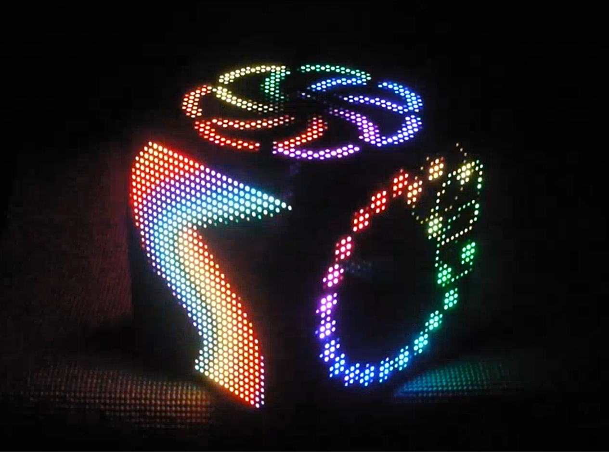

## The Cube is an art project to create a 6 sided LED cube which is a *interactive*, *decorative* and *customisable*.


#### The Makers Cube will provider users with:

#### - A beautiful object
#### - Fun and interesting interactions and games
#### - An intuitive experience


# View a video of The Cube

[Makers Cube Video](https://drive.google.com/file/d/0B8OJMhIN4INET0ZmSkEybzQ3dTg/view?usp=sharing)

[Making The Cube video ](https://drive.google.com/open?id=0B8OJMhIN4INEQ1dOS3dLZkZ4cTQ)


# Product

An interactive 6 sided battery powered LED cube
Powered by a raspberry pi miniature computer
Built on the Django web framework
Languages and technologies used: Python, HTML, CSS, JavaScript, Linux, Django channels (WebSockets)


## Features:

#### MVP:
* display images
* mood light

#### MVP 2:
* displaying the time
* "Panels" can be customised by app/webpage to choose what panels are shown and what is shown on them

#### MVP 3:
* Multiplayer games
 * Reaction Test
 * Simon-Says

#### MVP 4:
* Display slack mentions
* Display current weather forecast

#### Future Features:
* Orientation based

## Technologies:
* Linux
* Javascript
* HTML5
* CSS
* Python
* Django
* WebSockets
* Slack api
* OpenWeather api

## Hardware:
* LED Panel's
* Raspberry Pi
* Lithium Battery


# Technical notes

## Hardware:
  * 1 x Raspberry pi 3
  * 1 x MicroSD memory card (16gb minimum recommended)
  * 1 x Raspberry pi RGB Panel hat
  * 6 x 32x32 RGB LED Panels
  * 30cm of 16way IDC ribbon cable
  * 1 x 5v 30amp step-down convertor
  * 1 x 4s LiPo Battery (capacity is dependant on runtime required)
    * Optional 1x 5v 30a mains power supply
  * Mechano style right angle brackets to hold panels together
  * Mechano style strips to mount raspberry pi and battery to.
  * ~50 x m3 x 6mm screws
  * ~10 x m3 x 15mm screws
  * ~10 x m3 nylok nuts
  * Loctite (**not to be used on the nylok nuts**)
  * Battery connectors (XT60 or XT90 recommended)
  * 2.5mm jack plug with leads.


## Assembly:
  * Tools required:
    * Screwdriver
    * Wire Cutters
    * Soldering iron
    * Insulation tape

#### View a time-lapse video of assembling The Cube
    [Assembling The Cube time lapse video]()

Mount Right angle brackets to the 4 of the panels

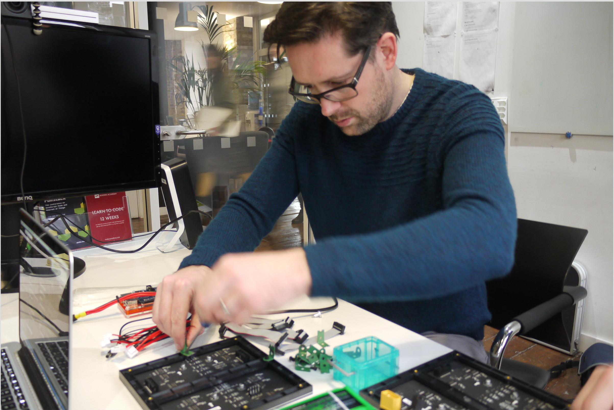

unscrew the 2 of the led panels from their frames to allow for mounting of the raspberry and battery mounts.

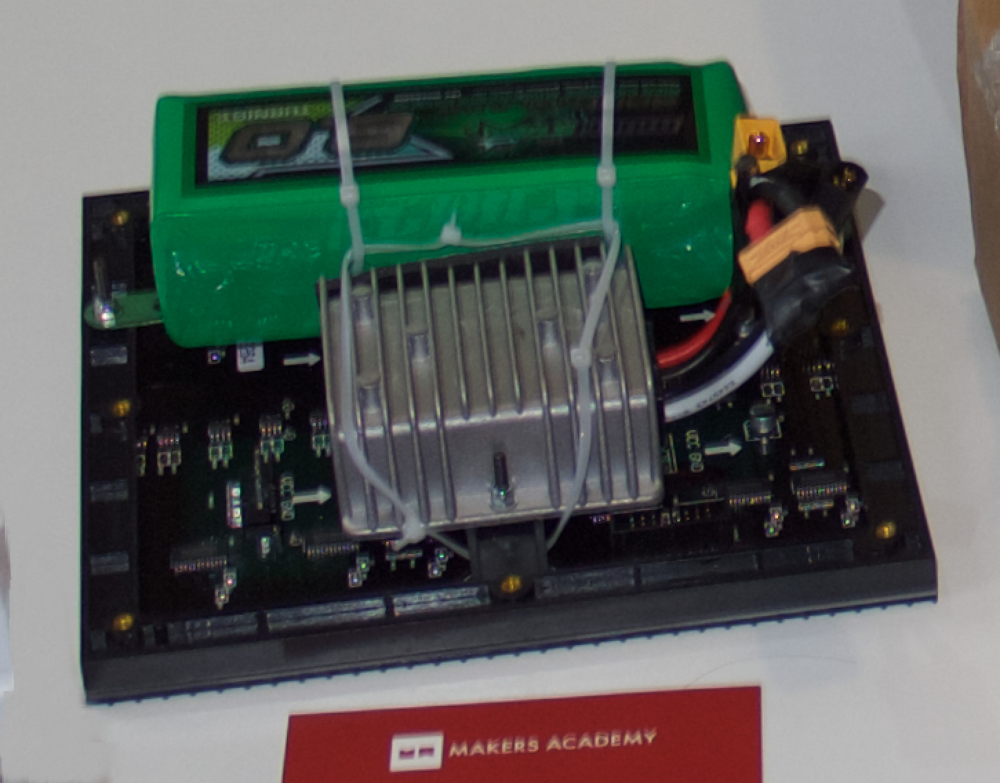


Solder all the connectors to the Pi RGB Hat except the screw terminals as these are not required.

Disassemble one idc connector to create a longer cable due to the distances between the panels being a little bit too short

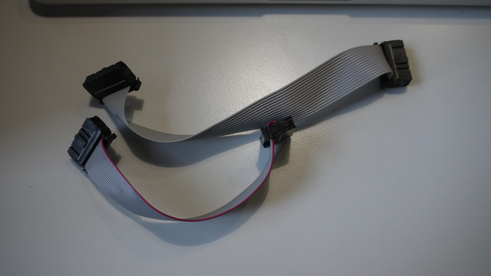

Join 3 of the power looms from the panels together (because the looms have 2 panel connectors on each you can save on lots of cables). add an XT60 connector to the end to allow you to switch between battery and desktop power supplies. Tap onto the power supply cables the 2.5mm jack plug plug to power the Pi through the Pi RGB Hat

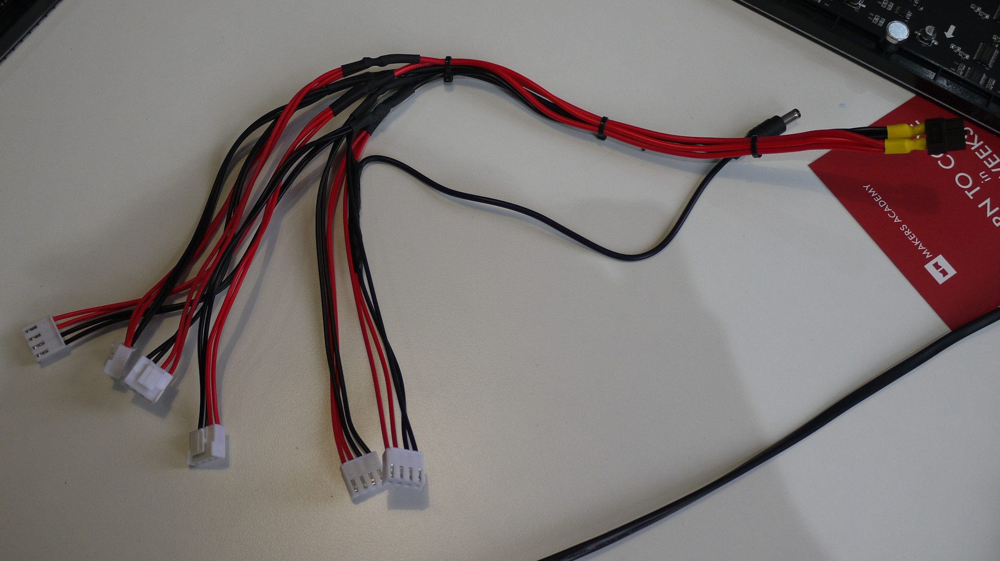

Bolt the 4 side panels together and then bolt to the base.

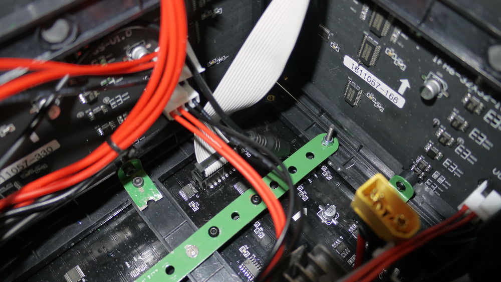

Bolt four brackets to the top centre holes holes of the side panels.

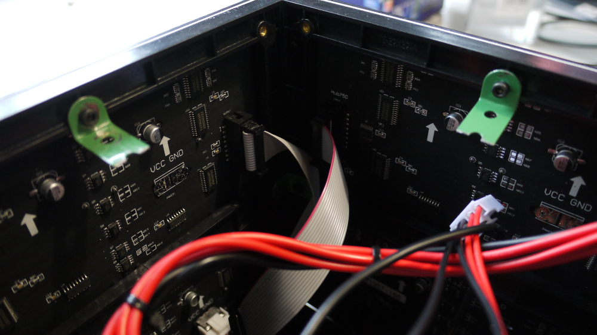

Screw in four of the magnets into the top plate and fix the raspberry pi to this panel.

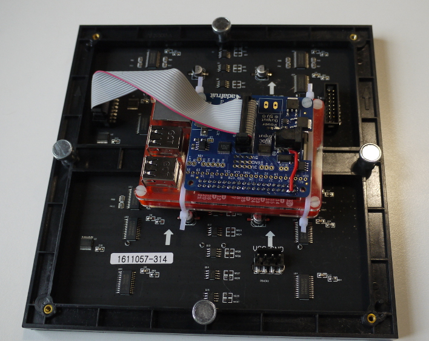

-----------------


# Software configuration:

Install Noobs Rasbian onto a microSD card [(Link to Noobs) ](https://www.raspberrypi.org/downloads/noobs) and start up your raspberry pi.

Update your packages:
```
$ sudo apt-get update
$ sudo apt-get upgrade
```

## Clone the Repo

This git repository has two submodules. These are basically separate git repositories nested within this git repository.

The sub modules are repositories that contain drivers for the LED screens. These can be used in a number of projects and should kept up to date.

To clone all of the nested repos run the following form the command line:

`$ git clone --recursive https://github.com/sultanhq/maker_cube.git`

If there has been a change to the sub modules you can pull all the updated modules using:

`$ git submodule update --recursive`


## Python

Python comes pre-installed with Noobs, and for this project, we are using Python 2.7, so only the other dependancies need to be installed.

Install Python PIP
```
$ sudo apt-get install python-pip
```
Install and setup virtualenv
```
$ sudo pip install virtualenv

$ mkdir -p ~/maker_cube/django-rpi
$ cd ~/maker_cube/django-rpi/

$ virtualenv venv && source venv/bin/activate
```

Install Python dev tools
```
$ apt-get install python-dev
```
Install and start Django
```
$ pip install django
$ django-admin startproject maker_cube_app
```

Finally run a Python migrate to complete the django setup.
```
$ python manage.py migrate
```

## LED Panels

Compile the led library executables

```
$ sudo apt-get install -y build-essential libconfig++-dev
$ cd rpi-fb-matrix
$ make
```

Copy the sample configuration file to the rpi-fb-matrix folder and rename removing the 'sample'

Setup chromium browser to autostart by copying the `autoChromium.desktop` file into the folder `~/.config/autostart/`

## rc.local file

to get the django webserver to run on start up along with the led matrix output, amend the following lines to ~/etc/rc.local (note the ***'&'***'s are important otherwise the Pi will lock up on boot) and make sure that is all before the `exit 0`

```
(sleep 15; cd /home/pi/maker_cube/django-rpi/maker_cube_app; /home/pi/maker_cube/django-rpi/venv/python /home/pi/maker_cube/django-rpi/maker_cube_app/manage.py runserver 0.0.0.0:8080)&
(sleep 45; cd /home/pi/maker_cube/rpi-fb-matrix; sudo ./rpi-fb-matrix/matrix.cfg)&
```

## turning off screen blanking

sudo nano ~/etc/lightdm/lightdm.conf

In that file, look for:

[SeatDefault]

and insert this line below it:

`xserver-command=X -s 0 dpms`

## using the mobile software

When the cube is turned on, by default the first thing it displays is its local IP address:

`192.168.XXX.YYY:8080`

where XXX and YYY are any numbers between 0 and 255.

Enter this address into a mobile device's browser, and you will be taken to the mobile web app that controls the cube!

From this page you can select what appears on what panel! `^` and `v` represent top and bottom and `1-4` are the horizontal faces.


To send a message to the cube, use this page. Simply type into the bar and press submit.

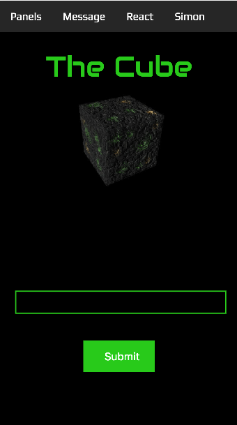

To play the Reaction game, type in your name into the box and press enter on your phone.

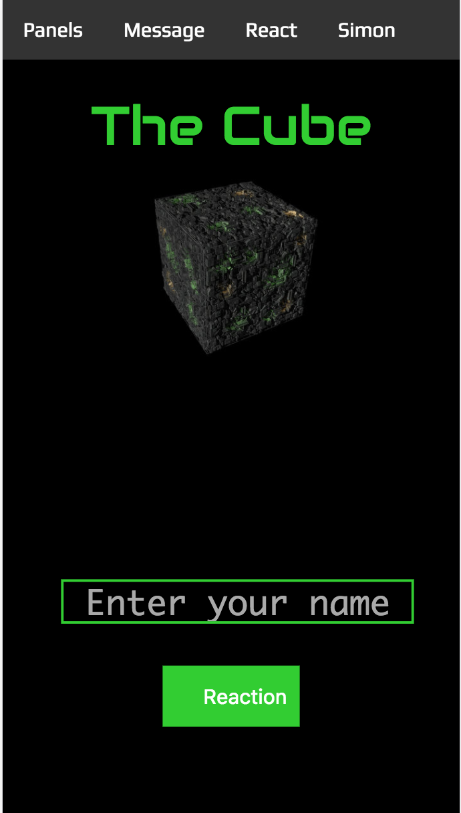

Press the green `Reaction` button and four red circles will appear on the Cube. When the circles turn green, hit the blue `REACT` button and win the game!


To play Simon Says, enter your name and press the enter button.

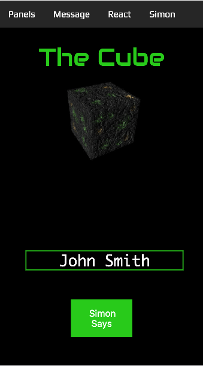
Watch the arrow prompts on the cube, try to remember them and repeat the pattern on your phone. Press the send button when you have entered the patten.


Play alone or with friends. Be careful, the pattern length increases by one after each attempt even if you get it wrong! (refresh your page to restart at the begginer level)


# sources:

http://raspberrypituts.com/raspberry-pi-django-tutorial-2017/

http://raspberrypi.stackexchange.com/questions/38515/auto-start-chromium-on-raspbian-jessie-11-2015

https://learn.adafruit.com/raspberry-pi-led-matrix-display

https://www.raspberrypi.org/forums/viewtopic.php?f=66&t=18200
